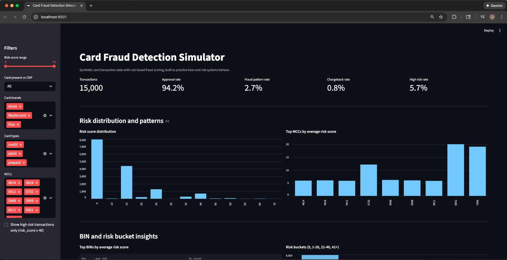
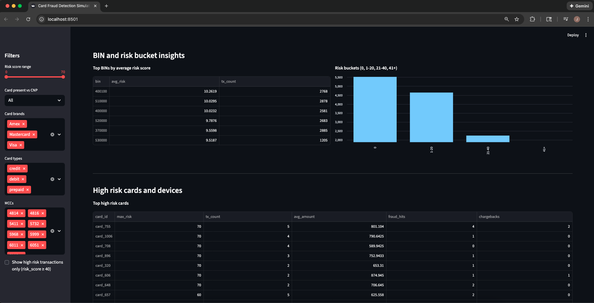
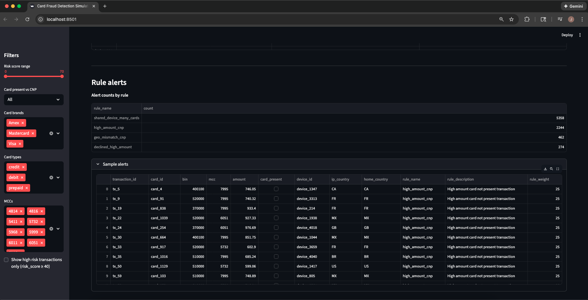
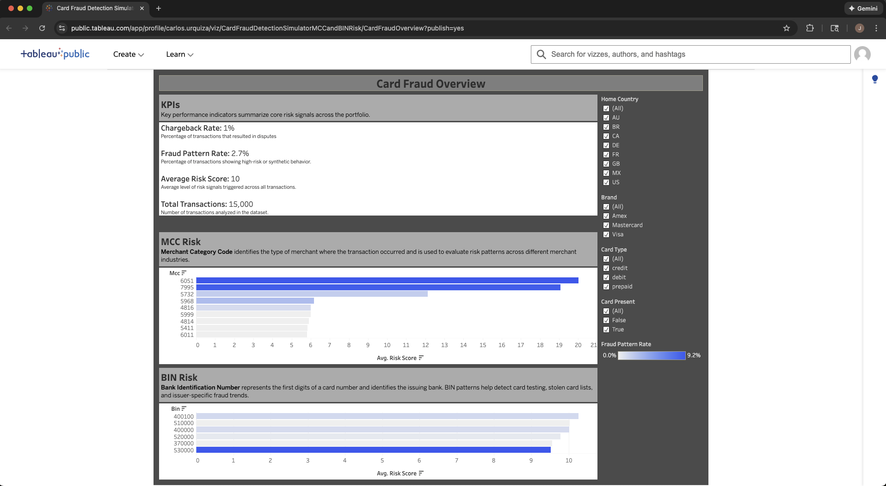

# Card Fraud Detection Simulator

Synthetic card transaction data, fraud patterns, risk scoring, and an analytics dashboard built to practice how modern card-not-present (CNP) fraud detection works in a fintech environment.

### **Streamlit Dashboard (Rule-Level & Transaction-Level View)**






### **Tableau Dashboard (Portfolio-Level Analytics & MCC/BIN Risk)**



<p align="center">
  <em>Interactive Streamlit and Tableau dashboards visualizing CNP fraud patterns, BIN/MCC concentration, and portfolio-level KPIs.</em>
</p>

---

## At a glance

**What this project demonstrates:**

- Understanding of card-not-present (CNP) fraud behavior and risk signals
- MCC and BIN-level fraud pattern analysis
- Python + pandas for data generation and rule-based scoring
- Building synthetic datasets that mirror real card fraud patterns
- Streamlit dashboard design for rule-level detail
- Tableau dashboard design for high-level portfolio analytics
- End-to-end workflow from data creation → scoring → BI visualization
- Ability to explain how card fraud works using self-built tools

**What you can review directly on GitHub:**

- Risk logic in `src/risk_rules.py`
- Data generation workflow in `src/generate_synthetic_data.py`
- Scored outputs in `data/`
- Exploratory analysis in `notebooks/card_fraud_analysis.ipynb`
- Streamlit dashboard in `dashboard/streamlit_app.py`
- Tableau-ready export in `src/export_for_bi.py`

---

## What this project does

This project simulates CNP card fraud to give a hands-on look at how fraud patterns emerge across merchant categories (MCC), issuing banks (BIN), device activity, geography, and card attributes.

### 1. Generates synthetic users and card transactions

- Includes card-present and card-not-present traffic
- Assigns MCCs, BINs, brands, card type, country, device ID
- Builds realistic spend patterns and timestamps

### 2. Injects realistic fraud behaviors

- Card testing attacks
- High-risk MCC exposure
- BIN ranges associated with synthetic identity
- Device + country mismatch patterns
- Elevated risk in specific card brands/types

### 3. Scores transactions using rule-based fraud detection

- Flags high-risk MCCs and BINs
- Detects device anomaly patterns
- Flags abnormal spend behavior
- Produces a `risk_score` and an alerts dataset

### 4. Analyzes behavior in a notebook

- BIN/MCC concentration
- Fraud pattern distributions
- Rule performance vs. synthetic fraud labels
- Average risk score trends
- Chargeback and fraud pattern rates

### 5. Visualizes insights in Streamlit

- KPI summary
- Rule-level inspection
- Device + user risk breakdown
- Transaction-level filtering

---

## **Tableau Dashboard (High-Level Portfolio Analysis)**

This project includes a **Tableau Public dashboard** that provides a polished, industry-style view of card fraud risk.

### **What the Tableau dashboard shows**

- **Portfolio KPIs**: chargeback rate, fraud pattern rate, average risk score, total volume
- **MCC Risk**: merchant categories with the highest concentration of risky behavior
- **BIN Risk**: issuing banks showing elevated fraud signals
- **Filters**: home country, brand, card type, card-present vs CNP

### **Why Tableau is included**

The Tableau layer demonstrates the ability to:

- Build BI tooling on top of fraud-scored datasets
- Communicate patterns at a portfolio level
- Present issuer and merchant-category exposure visually
- Mirror how fintech risk teams monitor fraud in real systems

### **Link to Tableau Dashboard**

[Card Fraud Overview Dashboard](https://public.tableau.com/app/profile/carlos.urquiza/viz/CardFraudDetectionSimulatorMCCandBINRisk/CardFraudOverview?publish=yes)

---

## Tech stack

- **Python** for data generation & scoring
- **pandas** for risk analysis
- **Jupyter Notebook** for exploration
- **Streamlit** for interactive interface
- **Tableau Public** for high-level BI visualization
- **matplotlib** for notebook plots

---

## Repository structure

```text
card-fraud-detection-simulator/
├─ data/
│  ├─ card_transactions.csv               # synthetic transactions
│  ├─ card_transactions_scored.csv        # scored transactions
│  ├─ card_transactions_for_bi.csv        # Tableau-ready export
│
├─ src/
│  ├─ generate_synthetic_data.py          # builds user + transaction data
│  ├─ risk_rules.py                       # rule-based scoring
│  ├─ run_scoring.py                      # runs scoring pipeline
│  └─ export_for_bi.py                    # cleans + exports BI-friendly dataset
│
├─ dashboard/
│  └─ streamlit_app.py                    # Streamlit interface
│
├─ notebooks/
│  └─ card_fraud_analysis.ipynb           # exploratory notebook
│
└─ docs/
   └─ img/
      └─ dashboard_preview.png            # Tableau screenshot
```

---

## How to review this project on GitHub without running anything

1. **Review the rule logic**
   `src/risk_rules.py` explains every scoring rule.

2. **Check the Jupyter notebook**
   `notebooks/card_fraud_analysis.ipynb` explores BIN/MCC patterns and rule performance.

3. **Explore the Tableau dashboard**
   Shows fraud exposure, KPIs, MCC/BIN concentration.

4. **Look at the Streamlit app**
   View detailed transaction-level and user-level risk breakdown.

---

## How to run it locally (optional)

<details>
<summary>Setup and run instructions</summary>

### 1. Clone the repository

```bash
git clone https://github.com/cloudquiza/card-fraud-detection-simulator.git
cd card-fraud-detection-simulator
```

### 2. Create and activate a virtual environment

```bash
python3 -m venv .venv
source .venv/bin/activate
```

### 3. Install dependencies

```bash
pip install pandas numpy jupyter streamlit matplotlib
```

_(Or use `pip install -r requirements.txt` if you have one set up.)_

### 4. Generate synthetic card transactions

```bash
python src/generate_synthetic_data.py
```

### 5. Score transactions with risk rules

```bash
python src/run_scoring.py
```

This creates `data/card_transactions_scored.csv` with `risk_score` and fraud pattern labels.

### 6. (Optional) Export BI-ready dataset for Tableau

```bash
python src/export_for_bi.py
```

This writes `data/card_transactions_for_bi.csv`, which is the file used as the data source for the Tableau dashboard.

### 7. Launch the Streamlit dashboard

```bash
streamlit run dashboard/streamlit_app.py
```

Streamlit will print a local URL (usually [http://localhost:8501](http://localhost:8501)) where you can interact with the dashboard.

### 8. Open the analysis notebook

```bash
jupyter notebook
```

Then open:

`notebooks/card_fraud_analysis.ipynb`

</details>

---

## Why I built this

This project helps me strengthen how I think about card fraud patterns, analyze BIN/MCC exposure, and communicate risk clearly through dashboards.

It also serves as an interview-ready artifact: I can walk through the dataset, scoring logic, and dashboards to explain CNP fraud signals the way a modern payments risk analyst would.

---
